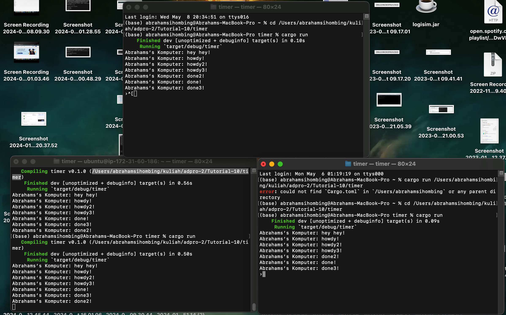
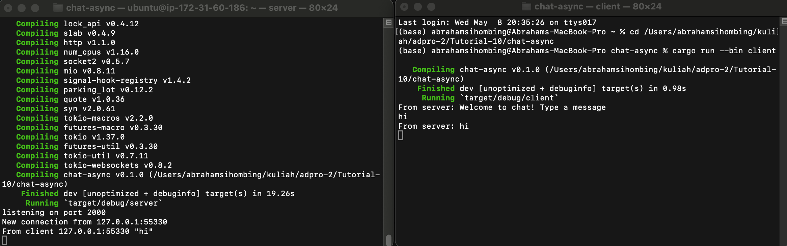
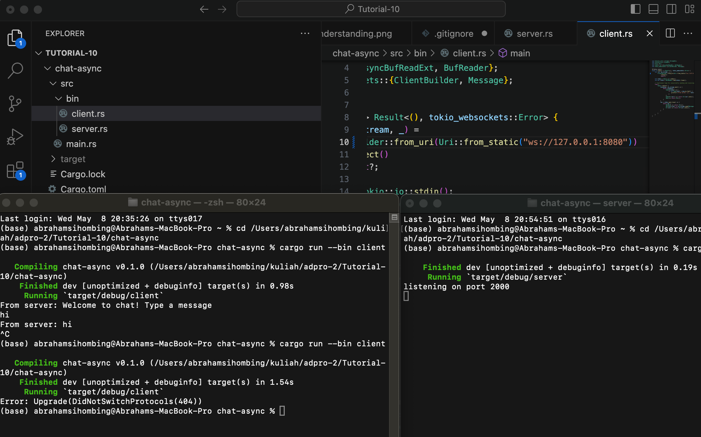

## Understanding how it works.
It works by spawning executor that will execute the given function. the print outside the spawner are executed first and then the spawner is spawned.

## Multiple Spawn and removing drop
because the spawner isn't dropped, the executor will keep running. because executor will wait until there are no spawner. the added spawner runs concurently and asyncly so it runs together.

## Original code, and how it run
this code simulates how client and server connection works. the message from the client are printed in the server.

## Modifying port
When the clienttry to connect to port 8080, it throws Error: Upgrade(DidNotSwitchProtocols(404)) because the port 8080 dont accepts the connection (server binded to listen at port 2000)
